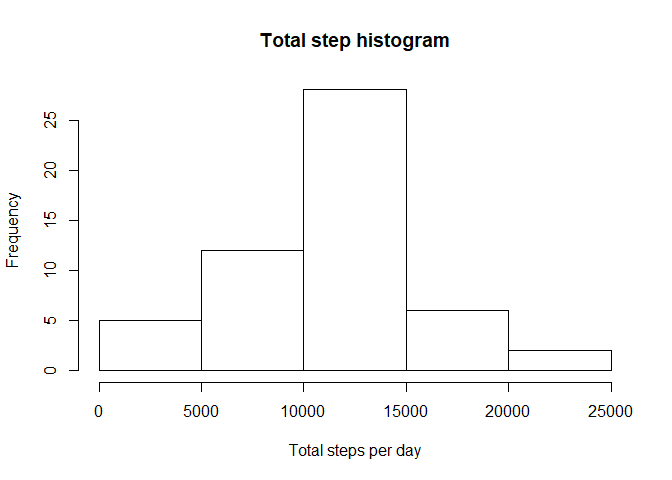
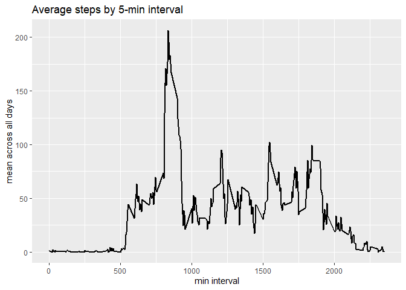
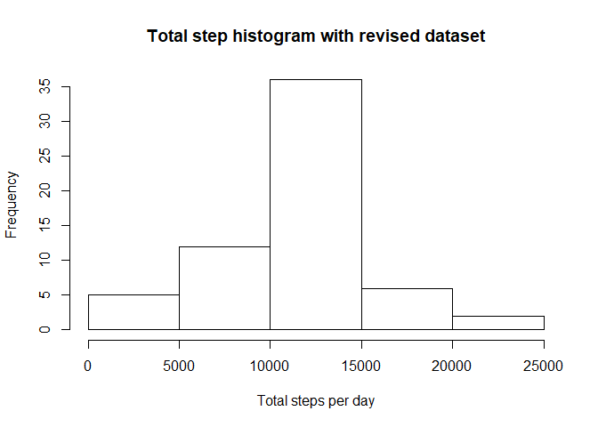
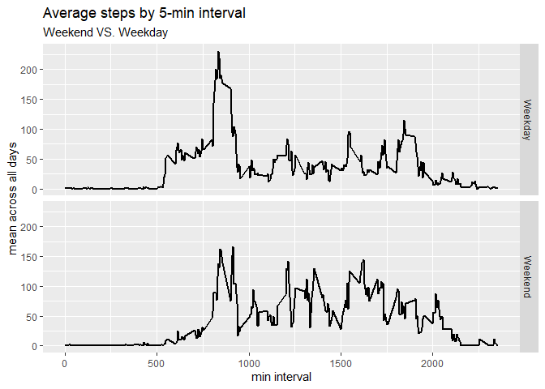

## Loading and preprocessing the data


1. Load the data

```r
act<-read.csv(unzip("activity.zip", "activity.csv"))    #load data
```

2. Process/transform the data (if necessary) into a format suitable for your analysis

```r
str(act)            #date column is factor. need to change to date. step column has many NA 
```

```
## 'data.frame':	17568 obs. of  3 variables:
##  $ steps   : int  NA NA NA NA NA NA NA NA NA NA ...
##  $ date    : Factor w/ 61 levels "2012-10-01","2012-10-02",..: 1 1 1 1 1 1 1 1 1 1 ...
##  $ interval: int  0 5 10 15 20 25 30 35 40 45 ...
```

```r
summary(act)        #all positive value.
```

```
##      steps                date          interval     
##  Min.   :  0.00   2012-10-01:  288   Min.   :   0.0  
##  1st Qu.:  0.00   2012-10-02:  288   1st Qu.: 588.8  
##  Median :  0.00   2012-10-03:  288   Median :1177.5  
##  Mean   : 37.38   2012-10-04:  288   Mean   :1177.5  
##  3rd Qu.: 12.00   2012-10-05:  288   3rd Qu.:1766.2  
##  Max.   :806.00   2012-10-06:  288   Max.   :2355.0  
##  NA's   :2304     (Other)   :15840
```

```r
unique(is.na(act$interval))
```

```
## [1] FALSE
```

```r
unique(is.na(act$date))         #only step column has NA values
```

```
## [1] FALSE
```

```r
act$date<-as.Date(as.character(act$date))     #change to date from factor
```


## What is mean total number of steps taken per day?


1. Calculate the total number of steps taken per day

```r
sum1<-tapply(act$steps, act$date, sum)
sum2<-data.frame(date=names(sum1), sum=sum1)    
#according to the total sums, 10/1, 10/8, 11/1, 11/4, 11/9, 11/10, 11/14, 11/30 has NA sum.
#needs to check if all steps value are NA for all the entries for these dates or if R produced NA for even just one NA value
library(dplyr)
```

```
## Warning: package 'dplyr' was built under R version 3.5.3
```

```
## 
## Attaching package: 'dplyr'
```

```
## The following objects are masked from 'package:stats':
## 
##     filter, lag
```

```
## The following objects are masked from 'package:base':
## 
##     intersect, setdiff, setequal, union
```

```r
NAs<-filter(act, date %in% as.Date(as.character(sum2[is.na(sum2$sum),1])))    # find all rows with the date's total sum equals NA
unique(NAs$steps)     #check if there is any other value than NA. It seems like all values are NA.
```

```
## [1] NA
```

```r
#Total number of steps take per day is
sum2<-sum2[!is.na(sum2$sum),]
sum2
```

```
##                  date   sum
## 2012-10-02 2012-10-02   126
## 2012-10-03 2012-10-03 11352
## 2012-10-04 2012-10-04 12116
## 2012-10-05 2012-10-05 13294
## 2012-10-06 2012-10-06 15420
## 2012-10-07 2012-10-07 11015
## 2012-10-09 2012-10-09 12811
## 2012-10-10 2012-10-10  9900
## 2012-10-11 2012-10-11 10304
## 2012-10-12 2012-10-12 17382
## 2012-10-13 2012-10-13 12426
## 2012-10-14 2012-10-14 15098
## 2012-10-15 2012-10-15 10139
## 2012-10-16 2012-10-16 15084
## 2012-10-17 2012-10-17 13452
## 2012-10-18 2012-10-18 10056
## 2012-10-19 2012-10-19 11829
## 2012-10-20 2012-10-20 10395
## 2012-10-21 2012-10-21  8821
## 2012-10-22 2012-10-22 13460
## 2012-10-23 2012-10-23  8918
## 2012-10-24 2012-10-24  8355
## 2012-10-25 2012-10-25  2492
## 2012-10-26 2012-10-26  6778
## 2012-10-27 2012-10-27 10119
## 2012-10-28 2012-10-28 11458
## 2012-10-29 2012-10-29  5018
## 2012-10-30 2012-10-30  9819
## 2012-10-31 2012-10-31 15414
## 2012-11-02 2012-11-02 10600
## 2012-11-03 2012-11-03 10571
## 2012-11-05 2012-11-05 10439
## 2012-11-06 2012-11-06  8334
## 2012-11-07 2012-11-07 12883
## 2012-11-08 2012-11-08  3219
## 2012-11-11 2012-11-11 12608
## 2012-11-12 2012-11-12 10765
## 2012-11-13 2012-11-13  7336
## 2012-11-15 2012-11-15    41
## 2012-11-16 2012-11-16  5441
## 2012-11-17 2012-11-17 14339
## 2012-11-18 2012-11-18 15110
## 2012-11-19 2012-11-19  8841
## 2012-11-20 2012-11-20  4472
## 2012-11-21 2012-11-21 12787
## 2012-11-22 2012-11-22 20427
## 2012-11-23 2012-11-23 21194
## 2012-11-24 2012-11-24 14478
## 2012-11-25 2012-11-25 11834
## 2012-11-26 2012-11-26 11162
## 2012-11-27 2012-11-27 13646
## 2012-11-28 2012-11-28 10183
## 2012-11-29 2012-11-29  7047
```


2. Make a histogram of the total number of steps taken each day


```r
hist(sum2$sum,main="Total step histogram", xlab="Total steps per day")
```

<!-- -->

3. Calculate and report the mean and median of the total number of steps taken per day


```r
summary(sum2)     #mean=10766 median=10765
```

```
##          date         sum       
##  2012-10-02: 1   Min.   :   41  
##  2012-10-03: 1   1st Qu.: 8841  
##  2012-10-04: 1   Median :10765  
##  2012-10-05: 1   Mean   :10766  
##  2012-10-06: 1   3rd Qu.:13294  
##  2012-10-07: 1   Max.   :21194  
##  (Other)   :47
```


## What is the average daily activity pattern?

1. Make a time series plot (i.e.type="l") of the 5-minute interval (x-axis) and the average number of steps taken, averaged across all days (y-axis)

```r
library(ggplot2)
int_mean<-act %>% group_by(interval) %>% summarize(mean=mean(steps, na.rm=TRUE))  #mean steps by interval
ggplot(data=int_mean, type="l",aes(x=interval, y=mean))+geom_line(size=1)+labs(x="min interval", y="mean across all days", title="Average steps by 5-min interval")
```

<!-- -->

2. Which 5-minute interval, on average across all the days in the dataset, contains the maximum number of steps?

```r
int_mean[which.max(int_mean$mean),1] #835 min interval
```

```
## # A tibble: 1 x 1
##   interval
##      <int>
## 1      835
```

## Imputing missing values

Note that there are a number of days/intervals where there are missing values (coded as NA). The presence of missing days may introduce bias into some calculations or summaries of the data.

1. Calculate and report the total number of missing values in the dataset (i.e. the total number of rows with NAs)


```r
nrow(act[is.na(act$steps),])  #2304 NA value
```

```
## [1] 2304
```


2. Devise a strategy for filling in all of the missing values in the dataset. The strategy does not need to be sophisticated. For example, you could use the mean/median for that day, or the mean for that 5-minute interval, etc.

I will use the mean for the 5-min interval to fill the missing values in the dataset.

3. Create a new dataset that is equal to the original dataset but with the missing data filled in.

```r
NAs_date<-unique(NAs$date)
act_r<-act
NA_r<-which(is.na(act$steps))
for (i in 1:length(NA_r)) {
  act_r[NA_r[i],1]=int_mean[which(int_mean$interval==act[NA_r[i],]$interval),2] #replace all NA values with mean interval for all days
}
```


4. Make a histogram of the total number of steps taken each day and Calculate and report the mean and median total number of steps taken per day. Do these values differ from the estimates from the first part of the assignment? What is the impact of imputing missing data on the estimates of the total daily number of steps?


```r
sum3<-act_r %>% group_by(date) %>% summarize(sum=sum(steps))
hist(sum3$sum, main="Total step histogram with revised dataset", xlab="Total steps per day")    #histogram
```

<!-- -->

```r
summary(sum3)   # mean=10766, median=10766
```

```
##       date                 sum       
##  Min.   :2012-10-01   Min.   :   41  
##  1st Qu.:2012-10-16   1st Qu.: 9819  
##  Median :2012-10-31   Median :10766  
##  Mean   :2012-10-31   Mean   :10766  
##  3rd Qu.:2012-11-15   3rd Qu.:12811  
##  Max.   :2012-11-30   Max.   :21194
```

In my case, the median changes. By replacing the NA values with the respective average 5-min invertal steps values, 8 more elements were added compared to the first part. Since 8 of 10766.19 were added to the sum dataset, we can see the histogram got taller between the 10000~15000 and the median shifted to 10766.19 as well.

## Are there differences in activity patterns between weekdays and weekends?
For this part the weekdays() function may be of some help here. Use the dataset with the filled-in missing values for this part.

1. Create a new factor variable in the dataset with two levels – “weekday” and “weekend” indicating whether a given date is a weekday or weekend day.


```r
act_w<-act_r
act_w$wdy<-weekdays(act_r$date)
act_w$wkdy<-"Weekday" #make all weekday
act_w$wkdy[which(act_w$wdy=="Sunday"|act_w$wdy=="Saturday")]<-"Weekend" #make saturday and sunday weekend
act_w$wkdy<-as.factor(act_w$wkdy)
```


2. Make a panel plot containing a time series plot (i.e. type="l") of the 5-minute interval (x-axis) and the average number of steps taken, averaged across all weekday days or weekend days (y-axis). See the README file in the GitHub repository to see an example of what this plot should look like using simulated data.


```r
int_mean2<-act_w %>% group_by(interval, wkdy) %>% summarize(mean=mean(steps, na.rm=TRUE))
ggplot(int_mean2, type="l",aes(x=interval, y=mean))+geom_line(size=1)+labs(x="min interval", y="mean across all days", title="Average steps by 5-min interval", subtitle="Weekend VS. Weekday")+facet_grid(wkdy ~ .)
```

<!-- -->


